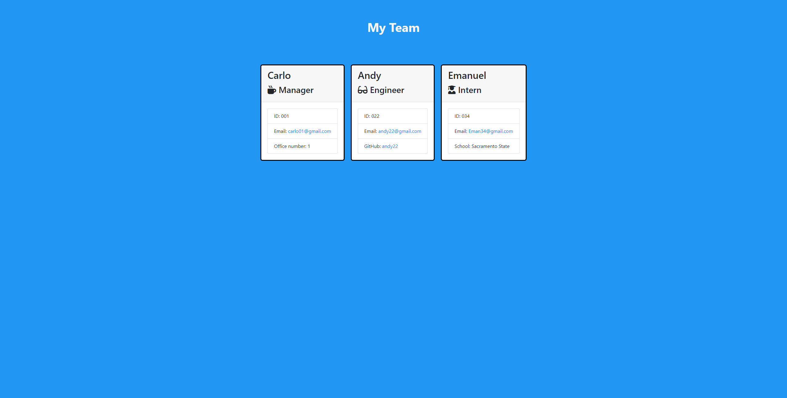

# Team Profile Generator

## Table of Contents

* [Description](#Description) 
* [Installation](#Installation)
* [Usage](#Usage) 
* [License](#license) 
* [Questions](#Questions)

  
## Description 
  
  A software engineering team generator command line application that prompts the user for information about their team. User can input any number for team members     based on roles (Manager, Engineer and Intern) and once complete a basic html page with the users team info is generated.

## Installation
  To create your own Team profile page: run `npm install` to install [`inquirer`](https://www.npmjs.com/package/inquirer) which will prompt you for inputs from the     command line.

   Application can be ran by typing `node app.js` in the terminal. 

## Usage 
  
  Run the application in the terminal using `node app.js`. You will be prompted to choose: 
  
  * `Manager` 
  * `Engineer`
  * `Intern`
  * `No more employees(create team page)` 
  
  IF: `Manager`, `Engineer` or `Intern` is picked 
  
  you will be prompted to answer questions based on that role. 
  
  IF: `No more employees(create team page)` is picked 
  
  your team page will be created. 
  
  

## License

Copyright (c) 2021 Carlo Joshua Serame

Permission is hereby granted, free of charge, to any person obtaining a copy of this software and associated documentation files (the "Software"), to deal in the Software without restriction, including without limitation the rights to use, copy, modify, merge, publish, distribute, sublicense, and/or sell copies of the Software, and to permit persons to whom the Software is furnished to do so, subject to the following conditions:

The above copyright notice and this permission notice shall be included in all copies or substantial portions of the Software.

THE SOFTWARE IS PROVIDED "AS IS", WITHOUT WARRANTY OF ANY KIND, EXPRESS OR IMPLIED, INCLUDING BUT NOT LIMITED TO THE WARRANTIES OF MERCHANTABILITY, FITNESS FOR A PARTICULAR PURPOSE AND NONINFRINGEMENT. IN NO EVENT SHALL THE AUTHORS OR COPYRIGHT HOLDERS BE LIABLE FOR ANY CLAIM, DAMAGES OR OTHER LIABILITY, WHETHER IN AN ACTION OF CONTRACT, TORT OR OTHERWISE, ARISING FROM, OUT OF OR IN CONNECTION WITH THE SOFTWARE OR THE USE OR OTHER DEALINGS IN THE SOFTWARE.
  

## Questions?
  Questions? please contact me:
 
  GitHub: [CJSerame24](https://github.com/CJSerame24)
  
  Email: carloserame24@gmail.com
  
